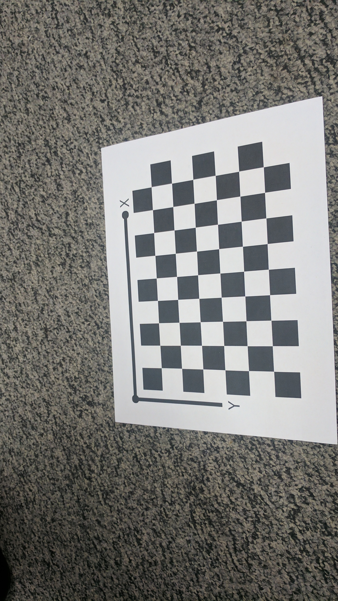
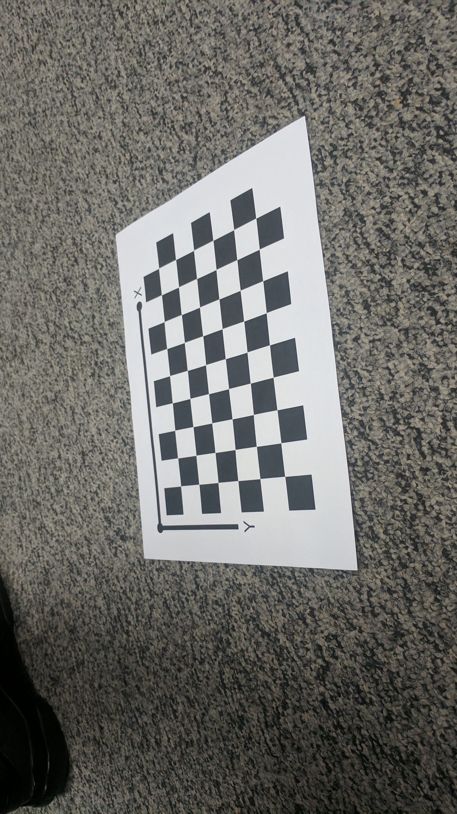
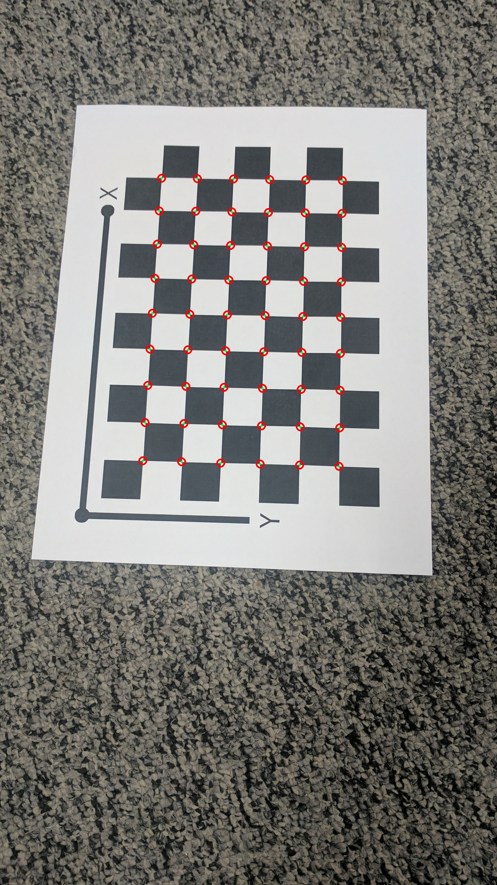
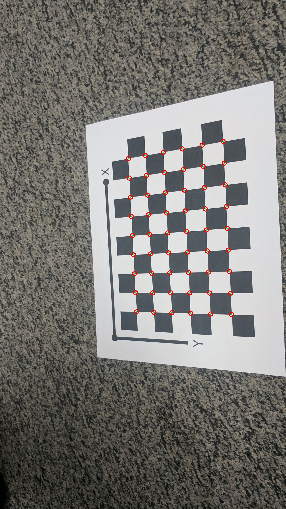
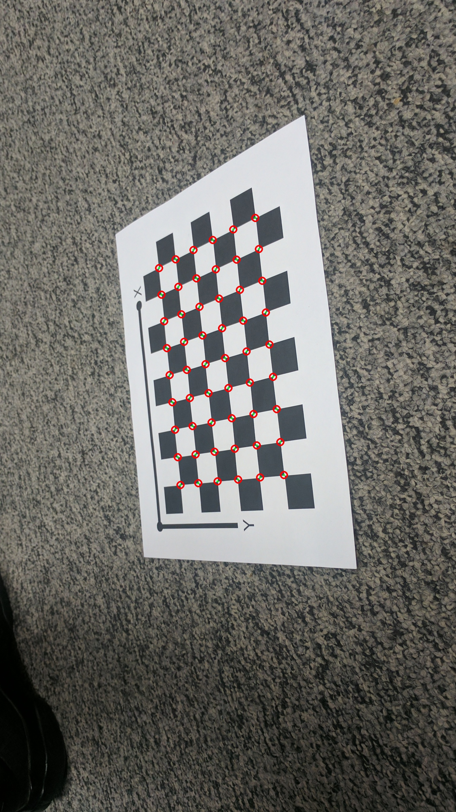

# Zhang-AutoCalib

### *RBE549: Computer Vision - [Worcester Polytechnic Institute](https://www.wpi.edu/), Spring 2024*

## Project Guidelines:
Details of the project can be found [here](https://rbe549.github.io/spring2024/hw/hw1/).

### Overview:
This project, AutoCalib, is aimed at estimating the intrinsic and extrinsic parameters of a camera using a checkerboard pattern for calibration. Following the seminal work by [Zhengyou Zhang](https://www.microsoft.com/en-us/research/wp-content/uploads/2016/02/tr98-71.pdf) , it involves capturing images of a checkerboard, detecting corners, estimating initial parameters, and refining these estimates through non-linear optimization.

### Data:
The data can be found [here](https://drive.google.com/file/d/1n5eKm-CCYSiu1r84wfgEtDrWBQTc0kTu/view?usp=sharing)

#### Steps to run the code:

To run Wrapper.py use the following command:
```bash
python Wrapper.py -d <PATH_TO_DATA_DIR>

usage: Wrapper.py [-h] [-d DATA]

optional arguments:
  -h, --help            show this help message and exit
  -d DATA, --data DATA  Path to calibration images
``` 


The Data should maintain the following structure:
```bash
DATA_DIR
├── Calibration_Imgs
│   ├── image_1.jpg
│   ├── image_2.jpg
│   ├── image_3.jpg
    ...
│   ├── image_13.jpg
```

Example to run the code on Set2:
```bash
python Wrapper.py -d Data
```

### Results:

#### Mean reprojection error(pixels) for calibration images before & after optimization

Image | #1 | #2 | #3 | #4 | #5 | #6 | #7 | #8 | #9 | #10 | #11 | #12 | #13 |
--- | --- | --- | --- |--- |--- |--- |--- |--- |--- |--- |---|--- |--- |
Before | 0.6915 | 0.7511 | 0.8717 | 0.9887 | 0.5966 | 0.7455 | 0.8452 | 0.5215 | 0.6857 | 0.6484 | 0.8570 | 0.9813 | 0.7548 |
After | 0.5459 | 0.6811 | 0.8173 | 0.9447 | 0.4782 | 0.5863 | 0.8361 | 0.4948 | 0.5919 | 0.5854 | 0.7530 | 0.8940 | 0.7348 |


1. Initial estimates:
   ```
   Intrinsic matrix:
      [[2053.04115 −0.46828715 762.798539]
      [0.00000000 2037.10197 1351.64446]
      [0.00000000 0.00000000 1.00000000]]

   distortion coefficients:
      [0.0, 0.0]
    ```

2. Optimization with distortion coefficients:
   ```
   Optimized Intrinsic matrix:
      [[2047.90769 −0.47797346 762.789954
      0.00000000 2031.46537 1351.66019
      0.00000000 0.00000000 1.00000000]]

   Distortion coefficients:
      [0.082086245 −0.45049271]
   ```

#### Input:
Calibration Images:
<p align="center">
  <table>
    <tr>
      <td>  </td>
      <td>  </td>
      <td>  </td>
    </tr>
    <tr>
      <td align="center">Image 1</td>
      <td align="center">Image 2</td>
      <td align="center">Image 3</td>
    </tr>
  </table>
</p>

#### Output:
Reprojected Corners:
<p align="center">
  <table>
    <tr>
      <td>  </td>
      <td>  </td>
      <td>  </td>
    </tr>
    <tr>
      <td align="center">Reprojected Corners for Image 1</td>
      <td align="center">Reprojected Corners for Image 2</td>
      <td align="center">Reprojected Corners for Image 3</td>
    </tr>
  </table>
</p>